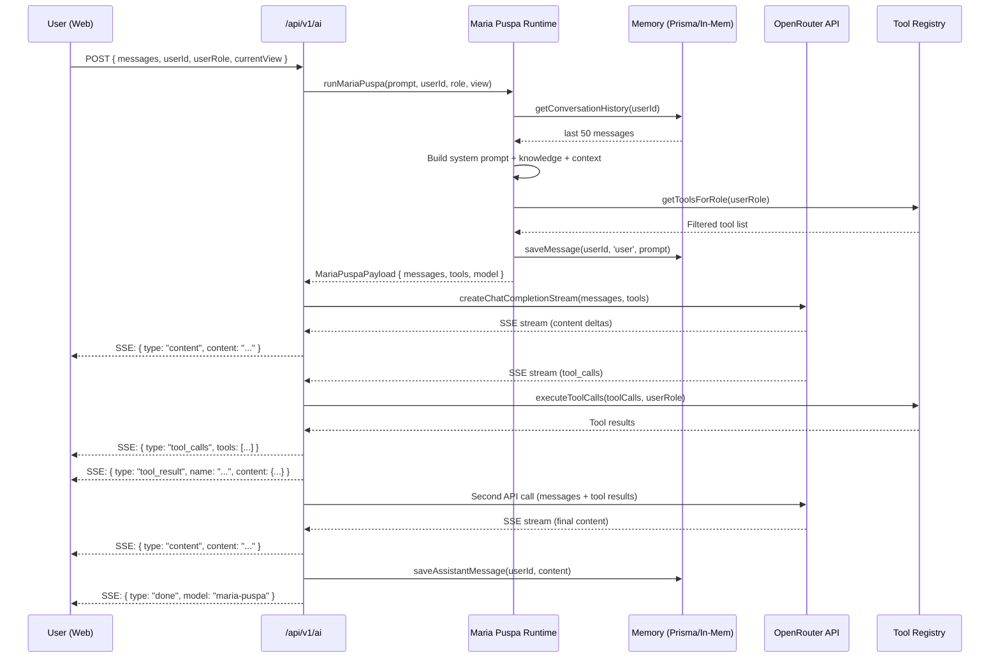

# AGENTS.md — Maria Puspa AI Agent System

> **PUSPA V5** — Pertubuhan Urus Peduli Asnaf (PPM-024-10-05012022)
> The definitive reference for the Maria Puspa AI agent architecture, runtime, tools, memory, and integrations.

---

## Table of Contents

1. [Overview](#1-overview)
2. [Identity & Persona](#2-identity--persona)
3. [Architecture Diagram](#3-architecture-diagram)
4. [Runtime Engine](#4-runtime-engine)
5. [System Prompt](#5-system-prompt)
6. [Tool System](#6-tool-system)
7. [Memory System](#7-memory-system)
8. [OpenRouter Client](#8-openrouter-client)
9. [Knowledge Base](#9-knowledge-base)
10. [PII Protection](#10-pii-protection)
11. [API Endpoints](#11-api-endpoints)
12. [SSE Stream Protocol](#12-sse-stream-protocol)
13. [Frontend: Chat Panel & Store](#13-frontend-chat-panel--store)
14. [Telegram Bot](#14-telegram-bot)
15. [Role-Based Access Control](#15-role-based-access-control)
16. [Configuration & Environment](#16-configuration--environment)
17. [File Map](#17-file-map)

---

## 1. Overview

Maria Puspa is the AI assistant embedded in the PUSPA NGO management platform. She follows the **Hermes Agent architecture** — a design pattern that enforces **mandatory RAG (Retrieval-Augmented Generation)**, **tool-calling with RBAC**, and **streaming responses** through OpenRouter (OpenAI-compatible API).

### Design Principles

| Principle | Implementation |
|---|---|
| **Mandatory RAG** | AI must call tools before answering any operational data question — never fabricate |
| **Role-Based Access** | Tools are filtered by user role (staff / admin / developer) at multiple layers |
| **PII Protection** | IC numbers always masked to `****XXXX` in tool responses |
| **Short & Sharp** | Responses capped at 2–3 sentences; no filler, no emojis |
| **Dual Interface** | SSE streaming for web app; non-streaming JSON for Telegram |
| **Graceful Degradation** | In-memory fallback when database is unavailable (Vercel serverless) |
| **Key Rotation** | Up to 4 OpenRouter API keys with automatic rotation on 429/5xx errors |

---

## 2. Identity & Persona

| Attribute | Value |
|---|---|
| **Name** | Maria Puspa |
| **Role** | AI Assistant for Pertubuhan Urus Peduli Asnaf |
| **Inspiration** | Hermes Agent architecture |
| **Personality** | Cerdas (Intelligent), Mesra (Friendly), Profesional, Empati (Empathetic), Boleh Dipercayai (Trustworthy) |
| **Languages** | Bahasa Melayu (primary), English (secondary) |
| **Response Style** | 2–3 ayat sahaja (max 2–3 sentences) |
| **Availability** | 24/7 |
| **Communication** | Jelas, Ringkas, Sopan, Berorientasikan Penyelesaian |

### Example Interactions

```
User:   Berapa ahli asnaf aktif sekarang?
Maria:  Terdapat 245 ahli asnaf aktif. 180 telah disahkan melalui eKYC, 65 masih menunggu pengesahan.

User:   Status sistem ok?
Maria:  Sistem dalam keadaan baik. Database berfungsi, 18 tools tersedia, 3 API keys aktif.

User:   Who is the chairman of PUSPA?
Maria:  Chairman PUSPA ialah Datuk Dr Narimah Awin (data 2023). Jawatan semasa mungkin berbeza.
```

---

## 3. Architecture Diagram

### High-Level Flow

```
┌─────────────────────────────────────────────────────────────────────┐
│                        USER INTERFACES                              │
│  ┌──────────────────┐              ┌──────────────────────────┐     │
│  │   Web App        │              │   Telegram Bot           │     │
│  │   (SSE Stream)   │              │   (JSON Response)        │     │
│  │   POST /api/v1/ai│              │   POST /api/v1/ai/       │     │
│  │                  │              │        telegram           │     │
│  └────────┬─────────┘              └────────────┬─────────────┘     │
└───────────┼─────────────────────────────────────┼───────────────────┘
            │                                     │
            ▼                                     ▼
┌─────────────────────────────────────────────────────────────────────┐
│                    MARIA PUSPA RUNTIME                              │
│                  hermes.runtime.ts                                  │
│                                                                     │
│  ┌──────────┐  ┌──────────────┐  ┌───────────┐  ┌──────────────┐  │
│  │  Memory  │→│ System Prompt │→│ Knowledge  │→│ Tool Registry │  │
│  │  Fetch   │  │    Build      │  │ Injection  │  │ (RBAC Filter)│  │
│  └──────────┘  └──────────────┘  └───────────┘  └──────┬───────┘  │
│                                                         │          │
│  ┌──────────┐                                           │          │
│  │  Save    │←──────────────────────────────────────────┘          │
│  │  User Msg│                                                      │
│  └──────────┘                                                      │
└─────────────────────────────┬───────────────────────────────────────┘
                              │
                              ▼
┌─────────────────────────────────────────────────────────────────────┐
│                     OPENROUTER CLIENT                               │
│                    openrouter.ts                                    │
│                                                                     │
│  ┌──────────────┐   ┌────────────────┐   ┌───────────────────┐    │
│  │ Key Rotation │   │ SSE Streaming  │   │ Non-Streaming     │    │
│  │ (4 keys)     │   │ (Web App)      │   │ (Telegram)        │    │
│  └──────────────┘   └───────┬────────┘   └───────┬───────────┘    │
│                             │                     │                 │
│                     ┌───────▼─────────────────────▼───────┐        │
│                     │   OpenRouter API                    │        │
│                     │   openai/gpt-4o-mini                │        │
│                     │   (OpenAI-compatible)               │        │
│                     └───────────────┬─────────────────────┘        │
└─────────────────────────────────────┼─────────────────────────────┘
                                      │
                                      ▼
┌─────────────────────────────────────────────────────────────────────┐
│                     TOOL EXECUTION                                  │
│                                                                     │
│  ┌─────────────────────────┐  ┌────────────────────────────┐       │
│  │ Domain Tools (14)       │  │ Web & System Tools (4)     │       │
│  │ • ping_system           │  │ • web_search (z-ai SDK)    │       │
│  │ • get_recent_donations  │  │ • web_read (z-ai SDK)      │       │
│  │ • get_donation_stats    │  │ • delegate_task             │       │
│  │ • get_active_cases      │  │ • system_health             │       │
│  │ • get_case_summary      │  └────────────────────────────┘       │
│  │ • get_member_list       │                                        │
│  │ • get_member_stats      │  ┌────────────────────────────┐       │
│  │ • get_active_programmes │  │ Admin-Only Tools (2)       │       │
│  │ • get_volunteer_stats   │  │ • approve_disbursement     │       │
│  │ • get_compliance_status │  │ • delete_case              │       │
│  │ • get_disbursement_summ │  └────────────────────────────┘       │
│  │ • get_dashboard_overview│                                        │
│  └─────────────────────────┘                                        │
│                                                                     │
│  RBAC Check → Execute → Return Result → Second AI Call              │
└─────────────────────────────────────────────────────────────────────┘
```

### Mermaid Sequence Diagram — Web App Request



---

## 4. Runtime Engine

**File**: `src/agents/runtime/hermes.runtime.ts`

The runtime is the central orchestrator. It prepares the payload for the OpenRouter API call and handles tool execution.

### `runMariaPuspa()`

```typescript
export async function runMariaPuspa(
  prompt: string,
  userId: string,
  userRole: string = 'staff',
  currentView: string = 'dashboard'
): Promise<MariaPuspaPayload>
```

**Execution flow**:

1. **Memory Fetch** — `getConversationHistory(userId)` loads last 50 messages
2. **System Prompt Build** — Combines `MARIA_PUSPA_SYSTEM_PROMPT` + PUSPA knowledge + current module context
3. **Knowledge Injection** — `getPuspaKnowledgeContext()` appends verified organizational data
4. **Tool Registry** — `getToolsForRole(userRole)` filters 18 tools by role, then `toOpenAITools()` converts to OpenAI function-calling format
5. **User Message Save** — `saveMessage(userId, 'user', prompt)` persists to memory
6. **Model Selection** — `getConfiguredModel()` returns the configured model name

**Returns** `MariaPuspaPayload`:

```typescript
interface MariaPuspaPayload {
  messages: MariaPuspaMessage[]  // Full conversation with system prompt
  tools: OpenAIToolFormat[]      // Role-filtered tools in OpenAI format
  userId: string
  userRole: string
  model: string                  // e.g., "openai/gpt-4o-mini"
}
```

### `executeToolCalls()`

```typescript
export async function executeToolCalls(
  toolCalls: ToolCall[],
  userRole: string
): Promise<MariaPuspaMessage[]>
```

Iterates through tool calls from the AI response:

1. Parse `arguments` JSON from each tool call
2. Call `executeTool(name, args, userRole)` — includes RBAC check
3. Return results as `tool` role messages with `tool_call_id`

### `saveAssistantMessage()`

```typescript
export async function saveAssistantMessage(userId: string, content: string)
```

Persists the final AI response to memory after streaming completes.

### `isMariaPuspaConfigured()`

```typescript
export function isMariaPuspaConfigured(): boolean
```

Checks if at least one `OPENROUTER_API_KEY_*` env var exists. Returns `false` if no keys are configured.

### Backward Compatibility Aliases

```typescript
export const runHermes = runMariaPuspa
export const isHermesConfigured = isMariaPuspaConfigured
export type HermesMessage = MariaPuspaMessage
export type HermesPayload = MariaPuspaPayload
```

---

## 5. System Prompt

The system prompt is the core instruction set injected as the first message in every conversation. It is defined as a constant in `hermes.runtime.ts`.

### Structure

The system prompt has these sections:

| Section | Purpose |
|---|---|
| **Identity** | Name, role, personality, languages, availability |
| **Core Rules — MANDATORY RAG** | Must use tools before answering; never fabricate; cite sources |
| **Response Format — SHORT & SHARP** | Max 2–3 sentences; bullet points for lists; no filler |
| **Project Editing Capabilities** | Full access to PUSPA operations via 18+ tools |
| **Available Modules Context** | Lists all PUSPA modules and what they manage |
| **Tool Usage Priority** | Ordered: DB tools → web_search → system_health → delegate_task → admin tools |
| **Security Rules** | IC masking; no over-sharing; RBAC enforcement; audit logging |

### Mandatory RAG Directive (Key Excerpt)

```
## Core Rules — MANDATORY RAG
- You MUST use tools to retrieve real data before answering ANY operational question
- NEVER fabricate or assume data — only report what tools return
- If no tool matches the question, use web_search to find real information
- If a web source is found, use web_read to extract detailed content
- Always cite the tool/source used
- If tools return empty results, state clearly: "Tiada data ditemui untuk pertanyaan ini"
```

### Context Assembly

The final system message is assembled dynamically:

```typescript
const contextPrompt = `${MARIA_PUSPA_SYSTEM_PROMPT}

${puspaKnowledge}

## Current Module
The user is currently viewing: **${currentView}** module.`
```

This means the system prompt always includes:
1. The static identity + rules prompt
2. The full PUSPA organizational knowledge base
3. The user's current module context (e.g., "dashboard", "members", "cases")

---

## 6. Tool System

**Files**: `src/tools/index.ts`, `src/tools/donations.ts`, `src/tools/cases.ts`, `src/tools/web-tools.ts`

### Tool Definition Interface

```typescript
interface MariaPuspaTool {
  name: string                                    // Unique snake_case name
  description: string                             // AI-readable description
  parameters: {                                   // JSON Schema (OpenAI format)
    type: 'object'
    properties: Record<string, unknown>
    required?: string[]
  }
  execute: (params: Record<string, unknown>) => Promise<unknown>  // Server-side execution
  requiredRole: ('staff' | 'admin' | 'developer')[]              // RBAC roles
}
```

### Complete Tool Registry — 18 Tools

#### Domain Tools (12)

| # | Tool | Access | Parameters | Description |
|---|---|---|---|---|
| 1 | `ping_system` | staff+ | _none_ | System health + DB connectivity status |
| 2 | `get_recent_donations` | staff+ | `limit?` (10–50) | Recent donations with donor, amount, category |
| 3 | `get_donation_stats` | staff+ | _none_ | Monthly donation totals by category |
| 4 | `get_active_cases` | staff+ | `status?` | Active cases with IC masking, priority, welfare score |
| 5 | `get_case_summary` | staff+ | `caseId` (required) | Detailed case with member info, notes, disbursements |
| 6 | `get_member_list` | staff+ | `category?`, `limit?` (max 100) | Asnaf member list with eKYC status |
| 7 | `get_member_stats` | staff+ | _none_ | Total members, asnaf breakdown, eKYC stats |
| 8 | `get_active_programmes` | staff+ | `limit?` | Active programme list with dates |
| 9 | `get_volunteer_stats` | staff+ | _none_ | Volunteer count (total, active, inactive) |
| 10 | `get_compliance_status` | staff+ | _none_ | Compliance records with overdue tracking |
| 11 | `get_disbursement_summary` | staff+ | _none_ | Disbursement totals by status |
| 12 | `get_dashboard_overview` | staff+ | _none_ | Cross-module dashboard metrics |

#### Web & System Tools (4)

| # | Tool | Access | Parameters | Description |
|---|---|---|---|---|
| 13 | `web_search` | staff+ | `query` (required) | Real-time web search via `z-ai-web-dev-sdk` |
| 14 | `web_read` | staff+ | `url` (required) | Extract page content (4000 char limit) via `z-ai-web-dev-sdk` |
| 15 | `delegate_task` | staff+ | `task_description` (req), `task_type?` | Delegate to sub-agent (simulated) |
| 16 | `system_health` | staff+ | _none_ | Full system health: DB, AI service, tool count, table counts |

#### Admin-Only Tools (2)

| # | Tool | Access | Parameters | Description |
|---|---|---|---|---|
| 17 | `approve_disbursement` | admin+ | `disbursementId` (required) | Approve pending disbursement (simulated) |
| 18 | `delete_case` | admin+ | `caseId` (required), `reason` (required) | Delete case with audit reason (simulated) |

### Role Access Matrix

| Tool Category | staff | admin | developer |
|---|---|---|---|
| Domain Tools (1–12) | ✅ | ✅ | ✅ |
| Web & System Tools (13–16) | ✅ | ✅ | ✅ |
| Admin Tools (17–18) | ❌ | ✅ | ✅ |

### Tool Execution Flow

```
OpenRouter returns tool_calls in SSE stream
         │
         ▼
executeToolCalls() iterates through tool calls
         │
         ▼
For each tool call:
  1. Parse arguments JSON
  2. Call executeTool(name, args, userRole)
     ├── Find tool in ALL_TOOLS registry
     ├── RBAC check: tool.requiredRole.includes(userRole)?
     │   ├── No → return { error: "Access denied" }
     │   └── Yes → tool.execute(params)
     │       ├── DB unavailable → return dbFallback(toolName)
     │       └── DB available → query and return data
     └── Return { result } or { error }
  3. Wrap result as tool role message with tool_call_id
         │
         ▼
Results sent back as tool messages in conversation
         │
         ▼
Second OpenRouter API call with tool results
         │
         ▼
Final AI response streamed to user
```

### Database Fallback

When the database is unavailable (e.g., Vercel serverless), tools return a graceful fallback:

```typescript
function dbFallback(toolName: string) {
  return {
    status: 'database_unavailable',
    message: `Pangkalan data tidak tersedia sekarang. Data untuk "${toolName}" tidak boleh dimuat. Sila cuba lagi nanti atau hubungi admin.`,
    hint: 'Feature ini memerlukan sambungan database yang aktif.',
  }
}
```

### PII Masking in Tools

IC number masking is enforced at the tool execution level (in `src/tools/cases.ts`):

```typescript
// In getActiveCases():
member: {
  id: c.member.id,
  name: c.member.name,
  asnafCategory: c.member.asnafCategory,
  icMasked: c.member.icNumber
    ? `****${c.member.icNumber.slice(-4)}`  // Always masked
    : null,
}

// In getCaseSummary():
member: {
  // ... same masking pattern
  icMasked: caseData.member.icNumber
    ? `****${caseData.member.icNumber.slice(-4)}`
    : null,
}
```

### OpenAI Format Conversion

Tools are converted to the OpenAI function-calling schema before being sent to the API:

```typescript
export function toOpenAITools(tools: MariaPuspaTool[]) {
  return tools.map((tool) => ({
    type: 'function' as const,
    function: {
      name: tool.name,
      description: tool.description,
      parameters: tool.parameters,
    },
  }))
}
```

---

## 7. Memory System

**File**: `src/lib/memory.ts`

### Architecture

The memory system uses a **primary + fallback** pattern:

```
┌──────────────────────┐
│   getConversation    │
│   History(userId)    │
└──────────┬───────────┘
           │
     checkDbAvailable()
           │
    ┌──────┴──────┐
    │             │
    ▼             ▼
┌────────┐  ┌──────────────┐
│ Prisma │  │ In-Memory    │
│ SQLite │  │ Map          │
│ (AIMem)│  │ (Fallback)   │
└────────┘  └──────────────┘
```

### Prisma Model

```prisma
model AIMemory {
  id        String   @id @default(uuid())
  userId    String
  role      String   // user, assistant, system, tool
  content   String
  createdAt DateTime @default(now())

  @@index([userId, createdAt])
}
```

### API

| Function | Signature | Description |
|---|---|---|
| `getConversationHistory` | `(userId: string) => Promise<Message[]>` | Returns last 50 messages for a user, ordered chronologically |
| `saveMessage` | `(userId, role, content) => Promise<void>` | Persists a single message to DB (or in-memory fallback) |
| `clearConversationHistory` | `(userId: string) => Promise<void>` | Deletes all messages for a user (DB + in-memory) |

### Key Constants

- **`MAX_HISTORY = 50`** — Maximum messages per user to avoid token overflow
- In-memory store auto-trims to `MAX_HISTORY` when exceeding `MAX_HISTORY * 2`

### DB Availability Check

The system checks database availability once at startup and caches the result:

```typescript
let dbAvailable: boolean | null = null

async function checkDbAvailable(): Promise<boolean> {
  if (dbAvailable !== null) return dbAvailable
  try {
    await db.aIMemory.findMany({ take: 1 })
    dbAvailable = true
  } catch {
    console.warn('[Memory] Database unavailable, using in-memory fallback')
    dbAvailable = false
  }
  return dbAvailable
}
```

If the DB query fails mid-operation, the function falls back to in-memory automatically.

---

## 8. OpenRouter Client

**File**: `src/lib/openrouter.ts`

### Configuration

| Env Variable | Default | Description |
|---|---|---|
| `OPENROUTER_BASE_URL` | `https://openrouter.ai/api/v1` | API base URL |
| `OPENROUTER_MODEL` | `openai/gpt-4o-mini` | Default model |
| `OPENROUTER_APP_NAME` | `PUSPA V4` | App name for OpenRouter rankings |
| `OPENROUTER_APP_URL` | `http://localhost:3000` | App URL for attribution |
| `OPENROUTER_API_KEY_1`–`_4` | — | Up to 4 API keys for rotation |

### Key Rotation

```
currentKeyIndex = 0

getNextKey() → API_KEYS[currentKeyIndex % API_KEYS.length]

rotateKey()   → currentKeyIndex = (currentKeyIndex + 1) % API_KEYS.length
                (Only rotates on 429 or 5xx errors)
```

Rotation triggers:
- HTTP 429 (rate limited)
- HTTP 5xx (server error)

### API Methods

| Method | Signature | Use Case |
|---|---|---|
| `createChatCompletionStream` | `(options) => ReadableStream<Uint8Array>` | Web app — SSE streaming |
| `createChatCompletion` | `(options) => Promise<JSON>` | Telegram — non-streaming |

### Request Headers

```typescript
{
  'Content-Type': 'application/json',
  'Authorization': `Bearer ${apiKey}`,
  'HTTP-Referer': OPENROUTER_APP_URL,      // Optional: for rankings
  'X-OpenRouter-Title': OPENROUTER_APP_NAME, // Optional: for rankings
}
```

### Default Parameters

| Parameter | Default |
|---|---|
| `temperature` | 0.7 |
| `max_tokens` | 2048 |
| `stream` | `true` (streaming) / omitted (non-streaming) |
| `tool_choice` | `'auto'` (when tools are provided) |

### Types

```typescript
interface OpenRouterMessage {
  role: 'system' | 'user' | 'assistant' | 'tool'
  content: string
  tool_call_id?: string
  name?: string
  tool_calls?: OpenRouterToolCall[]
}

interface OpenRouterToolCall {
  id: string
  type: 'function'
  function: { name: string; arguments: string }
}

interface OpenRouterTool {
  type: 'function'
  function: { name: string; description: string; parameters: Record<string, unknown> }
}
```

---

## 9. Knowledge Base

**File**: `src/lib/puspa-knowledge.ts`

The knowledge base contains verified PUSPA organizational data that is injected into the system prompt for every conversation. This ensures Maria Puspa's responses are grounded in real data.

### Contents

| Section | Data |
|---|---|
| **Identity & Registration** | Full name, acronym, ROS number PPM-024-10-05012022, geographic focus, contact info, donation account |
| **Leadership** | Chairman, Deputy Chairman, Treasurer, Deputy Secretary, Adviser (2023 data) |
| **Verified Partners** | PKB, S P Setia Foundation, Jaya Grocer, Free Food Society, Kloth Cares, LZS, ASNB, AKPK |
| **Verified Programmes** | 7 programmes with dates, locations, and beneficiary counts (2021–2023) |
| **Self-Reported Portfolio** | Food Aid (1,200+ families), Education (850+ students), Skills Training (300+), Healthcare (2,000+), Overall (5,000+ families) |
| **Transparency Assessment** | Audited statements: not public; Annual reports: not public; ROS: confirmed; Tax deductibility: not confirmed |
| **Key Dates** | Founded ~2018 (claimed), earliest verified activity Sep 2021, first AGM Dec 2023 |
| **AI Response Notes** | Distinguish verified vs self-reported; leadership data from 2023; website under construction |

### Self-Reported vs Verified Distinction

The knowledge base explicitly instructs the AI to differentiate:

> When asked about PUSPA metrics, always distinguish between "verified" and "self-reported" data. Self-reported metrics should be cited as "menurut laman web PUSPA".

### Injection Method

```typescript
export function getPuspaKnowledgeContext(): string {
  return PUSPA_KNOWLEDGE_BASE  // Returns the full knowledge string
}
```

Called during runtime:

```typescript
const puspaKnowledge = getPuspaKnowledgeContext()
const contextPrompt = `${MARIA_PUSPA_SYSTEM_PROMPT}\n\n${puspaKnowledge}\n\n...`
```

---

## 10. PII Protection

### IC Number Masking

All tool responses that include member IC numbers enforce masking at the data layer:

```typescript
// Pattern used in cases.ts (and should be used in all member-related tools):
icMasked: member.icNumber
  ? `****${member.icNumber.slice(-4)}`  // e.g., ****1234
  : null
```

| Input | Output |
|---|---|
| `901231105678` | `****5678` |
| `null` | `null` |

### Protection Layers

1. **Tool Level** — `getActiveCases()` and `getCaseSummary()` mask IC before returning data
2. **System Prompt** — Explicitly instructs: "Never reveal full IC numbers — always masked (****XXXX)"
3. **AI Memory** — Content is stored as-is, but tool responses already enforce masking before storage

### What Is NOT Masked

- Member names (needed for case identification)
- Asnaf categories (operational data)
- Financial amounts (operational data)
- Case descriptions (operational data)

---

## 11. API Endpoints

### `POST /api/v1/ai` — Web App (SSE Streaming)

**File**: `src/app/api/v1/ai/route.ts`

| Field | Description |
|---|---|
| **Input** | `{ messages, currentView, userId, userRole }` |
| **Output** | SSE stream (`text/event-stream`) |
| **Auth** | `userId` defaults to `'anonymous'`, `userRole` defaults to `'staff'` |
| **Config Check** | Returns 503 if OpenRouter not configured |

**Flow**:

1. Validate request body — extract last user message
2. Check `isMariaPuspaConfigured()`
3. Call `runMariaPuspa()` to build payload
4. Call `createChatCompletionStream()` with messages + tools
5. Process SSE stream in `handleSSEStream()`:
   - Stream content deltas to client
   - Buffer tool calls from stream
   - Execute tool calls via `executeToolCalls()`
   - Send tool call/results events to client
   - Make second API call with tool results
   - Stream final content to client
   - Save assistant message to memory
   - Send `done` event

### `POST /api/v1/ai/telegram` — Telegram Bot (Non-Streaming)

**File**: `src/app/api/v1/ai/telegram/route.ts`

| Field | Description |
|---|---|
| **Input** | `{ message, userId, userRole, currentView }` |
| **Output** | JSON `{ content, model, toolCalls, success }` |
| **Auth** | `userId` defaults to `'telegram-anonymous'` |
| **Config Check** | Returns failure message if not configured |

**Flow**:

1. Validate message
2. Check configuration
3. Call `runMariaPuspa()` to build payload
4. Call `createChatCompletion()` (non-streaming)
5. If tool calls present:
   - Execute via `executeToolCalls()`
   - Make second API call with tool results
6. Save assistant message to memory
7. Return JSON response

---

## 12. SSE Stream Protocol

The web app endpoint uses Server-Sent Events (SSE) for real-time streaming. The frontend parses these events to update the chat UI incrementally.

### Event Types

| Type | Direction | Payload | Description |
|---|---|---|---|
| `content` | Server → Client | `{ type: "content", content: "..." }` | Incremental text delta |
| `tool_calls` | Server → Client | `{ type: "tool_calls", tools: ["get_member_stats"] }` | Tools being executed |
| `tool_result` | Server → Client | `{ type: "tool_result", name: "...", content: {...} }` | Individual tool result |
| `done` | Server → Client | `{ type: "done", model: "maria-puspa", toolCalls: [...] }` | Stream complete |
| `error` | Server → Client | `{ type: "error", content: "..." }` | Error occurred |

### Stream Format

```
data: {"type":"content","content":"Terdapat "}

data: {"type":"content","content":"245 ahli"}

data: {"type":"content","content":" asnaf aktif."}

data: {"type":"tool_calls","tools":["get_member_stats"]}

data: {"type":"tool_result","name":"get_member_stats","content":"{\"total\":245,\"ekycVerified\":180}"}

data: {"type":"content","content":"Berikut adalah ringkasan:"}

data: {"type":"done","model":"maria-puspa","toolCalls":["get_member_stats"]}
```

### SSE Headers

```typescript
{
  'Content-Type': 'text/event-stream',
  'Cache-Control': 'no-cache',
  'Connection': 'keep-alive',
}
```

### Tool Call Buffering in SSE

Tool calls arrive incrementally in the SSE stream (id first, then arguments). The handler buffers them:

```typescript
// When tc.id arrives → start new tool call buffer
// When tc.function.arguments arrives → append to current buffer
// When stream ends → push buffered tool call to toolCallsBuffer
```

---

## 13. Frontend: Chat Panel & Store

### Zustand Store

**File**: `src/stores/hermes-store.ts`

The `useMariaPuspaStore` (aliased as `useHermesStore`) manages all AI chat state:

| State | Type | Description |
|---|---|---|
| `messages` | `MariaPuspaMessage[]` | Chat message history |
| `isStreaming` | `boolean` | Whether AI is currently responding |
| `modelName` | `string` | Current model name (always `"maria-puspa"`) |
| `toolCalls` | `ToolCallLog[]` | Log of tool calls with status |
| `lastError` | `string \| null` | Last error message |

**Message Interface**:

```typescript
interface MariaPuspaMessage {
  id: string
  role: 'user' | 'assistant' | 'system'
  content: string
  timestamp: Date
  model?: string
  toolCalls?: string[]
  isStreaming?: boolean
}
```

**Tool Call Log**:

```typescript
interface ToolCallLog {
  id: string
  tool: string
  status: 'success' | 'error' | 'pending'
  timestamp: Date
  result?: string
}
```

### `sendMessage()` Flow

The store's `sendMessage` function handles the full SSE lifecycle:

1. Add user message to local state
2. Add placeholder assistant message (`isStreaming: true`, `content: ''`)
3. `POST /api/v1/ai` with messages, currentView, userId, userRole
4. Parse SSE stream:
   - `content` → `updateLastAssistantMessage(content)` (append text)
   - `tool_calls` → `addToolCall()` for each tool
   - `tool_result` → `updateToolCall()` with status
   - `done` → `finalizeLastAssistantMessage()`
   - `error` → `setLastError()`
5. Set `isStreaming = false`

### AI Chat Panel Component

**File**: `src/components/ai-chat-panel.tsx`

| Feature | Implementation |
|---|---|
| **Layout** | Side panel on desktop (320px), bottom sheet on mobile (85vh/95vh) |
| **Mobile UX** | Swipe-to-dismiss (80px down), drag handle, expand/collapse |
| **Quick Prompts** | 4 preset buttons when chat is empty: Ringkasan, Kes, Derma, Sistem |
| **Context Badge** | Shows current module + user role (hidden on mobile) |
| **Tool Indicator** | Shows tool call count + success ratio |
| **Auto-scroll** | Scrolls to bottom on new messages; shows "scroll down" button |
| **Streaming UI** | Pulsing cursor during streaming, spinner while waiting for first chunk |
| **Error Banner** | Dismissible error bar at top |

### Welcome Message

```typescript
const WELCOME_MESSAGE = {
  id: 'welcome',
  role: 'assistant',
  content: 'Hai, saya Maria Puspa. AI Assistant PUSPA. Apa yang boleh saya bantu?',
  timestamp: new Date(),
  model: 'maria-puspa',
}
```

---

## 14. Telegram Bot

**File**: `mini-services/telegram-bot/index.ts`

### Architecture

```
┌──────────────────────────────────────────┐
│           TELEGRAM BOT SERVICE           │
│                                          │
│  ┌──────────┐     ┌──────────────────┐  │
│  │  Long    │────→│ Message Handler  │  │
│  │  Polling │     │ handleMessage()  │  │
│  └──────────┘     └────────┬─────────┘  │
│                            │             │
│                   ┌────────┴────────┐    │
│                   │ Command Handler │    │
│                   │ /start /help    │    │
│                   │ /reset /role    │    │
│                   │ /status         │    │
│                   └────────┬────────┘    │
│                            │             │
│                   ┌────────┴────────┐    │
│                   │ AI Query        │    │
│                   │ callMariaPuspa()│    │
│                   └────────┬────────┘    │
│                            │             │
│                   ┌────────▼────────┐    │
│                   │ PUSPA API       │    │
│                   │ /api/v1/ai/     │    │
│                   │   telegram      │    │
│                   └─────────────────┘    │
│                                          │
│  ┌──────────────────────────────────┐   │
│  │ Session Tracking                 │   │
│  │ Map<chatId, UserSession>         │   │
│  └──────────────────────────────────┘   │
└──────────────────────────────────────────┘
```

### Commands

| Command | Description |
|---|---|
| `/start` | Welcome message with feature overview |
| `/help` | List of all commands |
| `/reset` | Clear conversation session |
| `/role [staff\|admin\|developer]` | Change user access role |
| `/status` | Show session status, role, message count, allowlist mode |

### Session Management

```typescript
interface UserSession {
  chatId: number
  userId: string           // Format: "telegram-{telegram_user_id}"
  firstName?: string
  lastName?: string
  username?: string
  role: string             // Default: 'staff'
  lastActivity: Date
  messageCount: number
}
```

Sessions are stored in-memory (`Map<number, UserSession>`). They persist for the lifetime of the bot process.

### Access Control

- **Allowlist Mode**: If `ALLOWED_CHAT_IDS` env var is set, only listed chat IDs can interact
- **Open Mode**: If no allowlist configured, all chats are allowed
- Unauthorized users receive: "Maaf, anda tidak mempunyai akses kepada Maria Puspa."

### AI Bridge

The bot calls the PUSPA API endpoint:

```typescript
const PUSPA_AI_ENDPOINT = `${PUSPA_API_URL}/api/v1/ai/telegram`

async function callMariaPuspa(text, userId, userRole, currentView) {
  const res = await fetch(PUSPA_AI_ENDPOINT, {
    method: 'POST',
    headers: { 'Content-Type': 'application/json' },
    body: JSON.stringify({ message: text, userId, userRole, currentView, source: 'telegram' }),
  })
  // Handles both JSON and SSE responses with fallback parsing
}
```

### Message Handling Features

| Feature | Implementation |
|---|---|
| **Typing Indicator** | `sendChatAction` every 4 seconds while waiting |
| **Message Chunking** | Splits messages at 4000 chars at sentence/line boundaries |
| **Markdown Fallback** | Falls back to plain text if Markdown parsing fails |
| **Background Processing** | Messages processed in parallel (non-blocking) |
| **Health Logging** | Logs uptime, session count, poll errors every 5 minutes |
| **Pending Skip** | On startup, skips all pending updates to avoid processing old messages |

### Long Polling Configuration

```typescript
await fetch(`${TELEGRAM_API}/getUpdates`, {
  method: 'POST',
  body: JSON.stringify({
    offset: lastUpdateId + 1,
    timeout: 30,            // 30-second long poll
    allowed_updates: ['message'],
  }),
})
```

Poll loop: `while (true) { await poll(); await sleep(100ms); }`

---

## 15. Role-Based Access Control

RBAC is enforced at multiple layers across the system.

### Role Hierarchy

**File**: `src/lib/access-control.ts`

```typescript
const roleHierarchy: Record<Role, number> = {
  staff: 1,
  admin: 2,
  developer: 3,
}
```

**Rule**: Higher roles inherit lower role permissions.

### View Access Map

| View | Minimum Role |
|---|---|
| dashboard, members, cases, programmes, donations, donors, disbursements, volunteers, activities, documents, settings | staff |
| compliance, reports, ekyc, tapsecure, admin | admin |
| ai | developer |

### Tool Access (Runtime)

In `src/tools/index.ts`:

```typescript
// Filtering by role
export function getToolsForRole(userRole: string): MariaPuspaTool[] {
  return ALL_TOOLS.filter((tool) =>
    tool.requiredRole.includes(userRole as 'staff' | 'admin' | 'developer')
  )
}

// Execution-time RBAC check
export async function executeTool(name, params, userRole) {
  const tool = ALL_TOOLS.find((t) => t.name === name)
  if (!tool.requiredRole.includes(userRole)) {
    return { result: null, error: `Access denied: Role "${userRole}" cannot execute tool "${name}"` }
  }
  // ... execute
}
```

### RBAC Enforcement Points

| Layer | Where | How |
|---|---|---|
| **Tool Registry** | `getToolsForRole()` | Filters tools before sending to AI — AI never sees tools it can't use |
| **Tool Execution** | `executeTool()` | Double-checks role before executing — prevents prompt injection |
| **View Access** | `canAccessView()` | Controls which UI modules the user can see |
| **Telegram Bot** | `/role` command | Users can change role; allowlist controls access |

---

## 16. Configuration & Environment

### Required Environment Variables

```bash
# OpenRouter API Keys (at least 1 required, up to 4 for rotation)
OPENROUTER_API_KEY_1=sk-or-v1-...
OPENROUTER_API_KEY_2=sk-or-v1-...    # Optional
OPENROUTER_API_KEY_3=sk-or-v1-...    # Optional
OPENROUTER_API_KEY_4=sk-or-v1-...    # Optional

# OpenRouter Configuration
OPENROUTER_BASE_URL=https://openrouter.ai/api/v1   # Default
OPENROUTER_MODEL=openai/gpt-4o-mini                 # Default
OPENROUTER_APP_NAME=PUSPA V4                        # Default
OPENROUTER_APP_URL=http://localhost:3000             # Default

# Database
DATABASE_URL=file:./dev.db                           # SQLite

# Telegram Bot (required for Telegram service)
TELEGRAM_BOT_TOKEN=123456:ABC-DEF...
PUSPA_API_URL=http://localhost:3000                  # Default

# Telegram Access Control
ALLOWED_CHAT_IDS=123456789,987654321                # Comma-separated, optional
```

### Configuration Check

```typescript
// In runtime
export function isMariaPuspaConfigured(): boolean {
  return isConfigured()  // Checks if API_KEYS.length > 0
}

// In API route
if (!isMariaPuspaConfigured()) {
  return NextResponse.json({
    content: 'Maaf, Maria Puspa tidak dikonfigurasi...',
    success: false,
  }, { status: 503 })
}
```

### Startup Validation

- **Web App**: Logs key count on startup: `[OpenRouter] 3 API key(s) loaded`
- **Telegram Bot**: Validates bot token with `getMe` API call; exits if invalid

---

## 17. File Map

All files related to the Maria Puspa AI agent system:

```
src/
├── agents/
│   └── runtime/
│       └── hermes.runtime.ts          # Core runtime: prompt build, tool exec, memory
│
├── tools/
│   ├── index.ts                       # Tool registry, RBAC, OpenAI format conversion
│   ├── donations.ts                   # Domain tools: getRecentDonations, getDonationStats
│   ├── cases.ts                       # Domain tools: getActiveCases, getCaseSummary (PII masked)
│   └── web-tools.ts                   # web_search, web_read (z-ai SDK), delegate_task, system_health
│
├── lib/
│   ├── memory.ts                      # AI memory: Prisma SQLite + in-memory fallback
│   ├── openrouter.ts                  # OpenRouter client: key rotation, streaming/non-streaming
│   ├── puspa-knowledge.ts             # PUSPA organizational knowledge base for RAG
│   ├── access-control.ts              # RBAC: role hierarchy, view access map
│   ├── db.ts                          # Prisma client instance
│   ├── maria-avatar.ts                # Maria Puspa avatar URI for UI
│   ├── store.ts                       # Zustand app store (ViewId type, currentView, user)
│   └── utils.ts                       # Utility functions
│
├── stores/
│   └── hermes-store.ts                # Zustand AI chat store: messages, streaming, tool calls
│
├── components/
│   └── ai-chat-panel.tsx              # AI chat UI: side panel, mobile bottom sheet, SSE parsing
│
├── app/api/v1/
│   ├── ai/
│   │   ├── route.ts                   # POST /api/v1/ai — SSE streaming endpoint (web app)
│   │   └── telegram/
│   │       └── route.ts               # POST /api/v1/ai/telegram — JSON endpoint (Telegram)
│   └── ...                            # Other API routes (members, cases, donations, etc.)
│
├── modules/
│   └── ai/
│       └── page.tsx                   # AI module page (developer-only view)
│
└── types/
    └── index.ts                       # Shared TypeScript types

mini-services/
└── telegram-bot/
    └── index.ts                       # Telegram bot: long polling, commands, AI bridge

prisma/
└── schema.prisma                      # Database schema including AIMemory model
```

---

## Appendix A: Quick Reference — Adding a New Tool

To add a new tool to Maria Puspa:

1. **Define the tool** in `src/tools/index.ts` (or a new file imported there):

```typescript
const my_new_tool: MariaPuspaTool = {
  name: 'my_new_tool',
  description: 'Description for the AI model to understand when to use this tool',
  parameters: {
    type: 'object',
    properties: {
      query: { type: 'string', description: 'Search query' },
    },
    required: ['query'],
  },
  execute: async (params) => {
    if (!(await isDbReady())) return dbFallback('my_new_tool')
    // Your logic here
    return { result: 'data' }
  },
  requiredRole: ['staff', 'admin', 'developer'],  // Set minimum role
}
```

2. **Register** it in `ALL_TOOLS` array:

```typescript
const ALL_TOOLS: MariaPuspaTool[] = [
  // ... existing tools
  my_new_tool,
]
```

3. **PII check**: If the tool returns member data, mask IC numbers using the `****XXXX` pattern.

4. **Test**: Verify RBAC filtering works by testing with different roles.

---

## Appendix B: Error Handling Patterns

### API Errors

| Scenario | Web App Response | Telegram Response |
|---|---|---|
| OpenRouter not configured | 503 JSON `{ success: false }` | JSON `{ success: false }` |
| No user message | 400 JSON `{ error: "No valid user message" }` | 400 JSON `{ error: "No valid message" }` |
| OpenRouter API error | SSE `{ type: "error" }` | JSON `{ success: false, content: "Maaf..." }` |
| Stream interrupted | SSE `{ type: "error", content: "Stream interrupted" }` | N/A |

### Tool Errors

| Scenario | Response |
|---|---|
| Tool not found | `{ error: 'Tool "name" not found' }` |
| Access denied (RBAC) | `{ error: 'Access denied: Role "staff" cannot execute tool "delete_case"' }` |
| DB unavailable | `{ status: 'database_unavailable', message: '...' }` |
| Execution failure | `{ error: 'Tool execution failed: ...' }` |

### Memory Errors

| Scenario | Behavior |
|---|---|
| DB unavailable at startup | Falls back to in-memory Map; logs warning |
| DB query fails mid-operation | Falls back to in-memory; logs warning |
| DB write fails | Falls back to in-memory; logs warning |

---

## Appendix C: Currency & Formatting Conventions

| Convention | Standard |
|---|---|
| Currency | `RM` or `MYR` (e.g., RM 1,250.00) |
| IC Masking | `****XXXX` (last 4 digits only) |
| Dates | ISO 8601 (e.g., `2023-04-15`) |
| Response Language | Bahasa Melayu primary, English secondary |
| Tool Citation | "Berdasarkan data derma terkini...", "Menurut sumber web..." |
| No Data Response | "Tiada data ditemui untuk pertanyaan ini" |

---

*Last updated: 2026-03-04 | PUSPA V5 | Maria Puspa AI Agent System*
